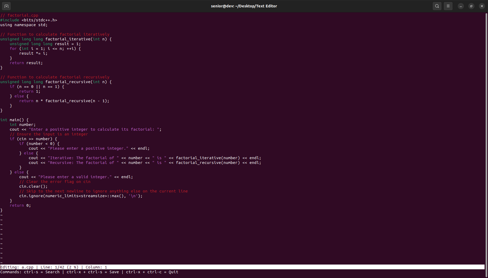
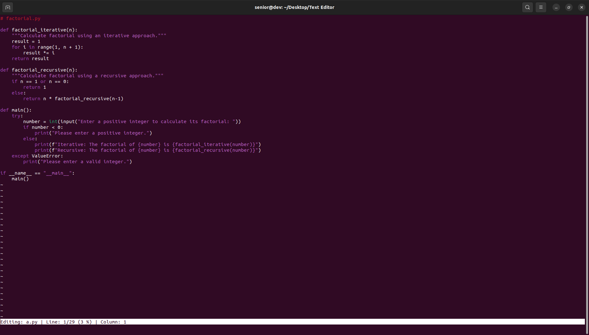

# Text Editor (tex)

-   `./tex <filename>`: This is the command to open a file with the text editor. Replace `<filename>` with the actual name of the file you wish to edit.

### Navigation and Editing Keys:

-   **ctrl-a**: Go to start of line
-   **ctrl-e**: Go to end of line
-   **ctrl-k**: Cut (kill) line
-   **ctrl-l**: Re-center screen vertically and refresh the display.
-   **ctrl-n**: Go to next line (alternative: arrow down)
-   **ctrl-p**: Go to previous line (alternative: arrow up)
-   **ctrl-q**: Quoted insert - insert character as-is
-   **ctrl-s**: search
-   **ctrl-y**: Yank line
-   **ctrl-z**: Suspend

### File Management Keys:

-   **ctrl-x ctrl-s**: Save
-   **ctrl-x ctrl-c**: Exit

### Syntax Highlighting Support:

-   The editor supports syntax highlighting for programming languages such as C, C++, and Python, based on the file extension (e.g., `.c`, `.cpp`, `.py`).

### Screenshots

